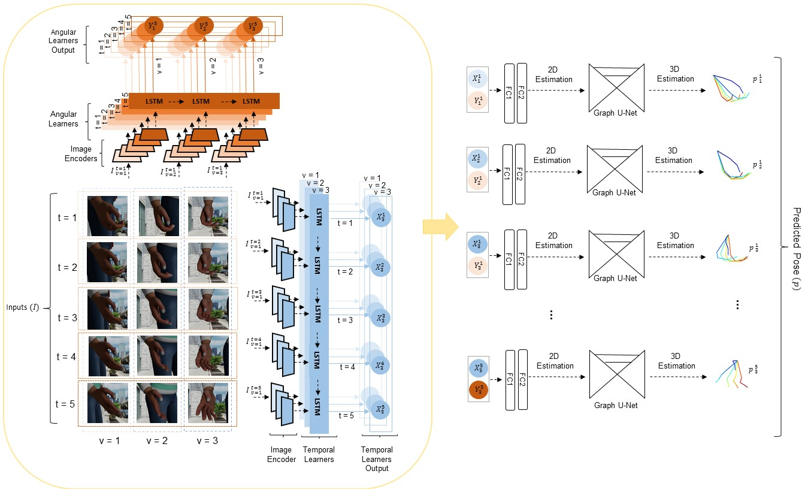
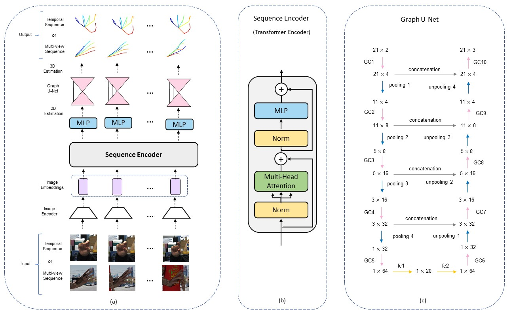
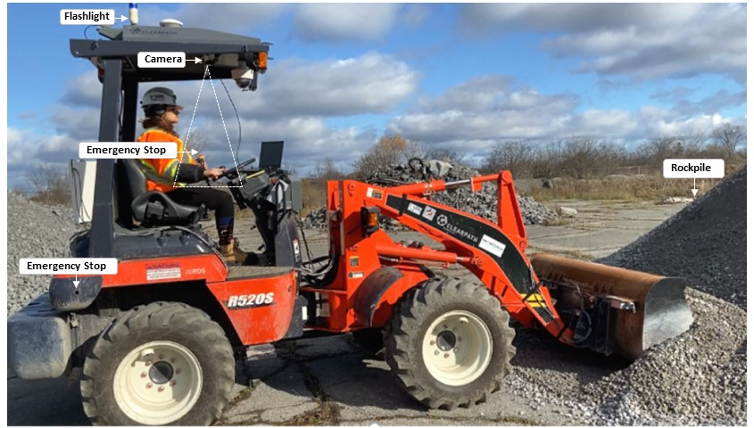

## Leyla Khaleghi

[Email](mailto:hello@workwithcarolyn.com)  / [LinkedIn](https://www.linkedin.com/in/leyla-khaleghi-01050614a/) / [GitHub](https://github.com/LeylaKhaleghi) / 

## 🔨 Technical Skills
- Python and Matlab
- Deep learning: Pytorch, Keras
- Machine learning: Scikit-Learn
- Data analysis; Panda, Numpy, Scipy
- C, Java, HTML, CSS, SQL
- 3D computer graphics (Blender), Open Cv
- Robot operating system (ROS)
- Linux-Windows

## 💻 Technical Experience

**Research Assistant** @ [Ingenuity Labs Research Institute](https://ingenuitylabs.queensu.ca/) _(Jan 2020 - Present)_   
<b>MuViHand: Multi-view Video-based 3D Hand Pose Estimation</b>
- Generating synthetic hand pose dataset includes more than 402,000 hand images.
Download MuViHand datset [here](https://doi.org/10.5683/SP3/ZHCCZB).

  

- Estimating 3D hand pose from multi-view videos with a deep network consisting of RNN layers and GCN layers.
Please see this [paper](https://arxiv.org/abs/2109.11747) for more details.

  

- Tools: Python, Pytorch, Open Cv, [Blender](https://www.blender.org/), Matlab.
  
 <b>Learning Sequential Contexts using Transformer for 3D Hand Pose Estimation</b>
- Implementing vision transformers in 3D hand pose estimation

  

- Tools: Python, Pytorch, Open Cv.
  
 <b>Towards Touchless Control of Heavy Equipment with Low-Cost Hand Gesture Recognition</b>
- Controlling a loader with a non-wearable hand gesture recognition through Robot Operation System (ROS)

  

- Tools: Pytorch, Open Cv, Ros. 
  

**Research Assistant** @ [Dynamics of Complex Systems and Networks Laboratory](https://aut.ac.ir/printme.php?item=2.2495.3891.en) _(July 2017 - Sep 2019)_   
 <b>Chimera states in a ring of map-based neurons</b>
- Working on Coexistence of synchronous and asynchronous behaviours on a discrete systems. Please see this [paper](https://www.sciencedirect.com/science/article/abs/pii/S0378437119314840) for more details.
- Tools: Matlab.
  

## 📎Teaching Experience

<b>Teaching Assistant</b>@ [Queen's University](https://www.ece.queensu.ca/) _(Jan 2021 - Dec 2021)_  
- Helping the professor and the students with labs and exams
- Courses: Electronics I and Digital Systems

  
 
<b>Tutor</b>@ Danesh shafie highschool _(Jan 2017 - Dec 2019)_  
 - Helping students for preparing for the national entrance exam of Iran 
 - Courses: Algebra and Geometry
  

## ♦️ Volunteer Experience

<b>Event Organizer</b>@ [Ingenuity Labs Research Institute](https://ingenuitylabs.queensu.ca/symposium2021/) _(May 2021 - Oct 2021)_  
- Helping in organizing the first Robotics and AI Symposium

  
 <b>Technical committee</b>@ [Fira 2016](http://autcup.aut.ac.ir/2016/visitorpages/default.aspx?itemid=3/) _(Sep 2016  - Dec 2016)_  
-  Helping students to learn and being prepared for robotic competition

 
  

## 📌 On The Side

<b>Store Associate</b>@[Loblaw Companies Limited](https://www.loblaw.ca/)_(Oct 2020 - Dec 2021)_  
- Helping customers by giving information about products and services, taking orders, and processing returns

  

## 💬 Languages

**English**: Advance  
**Persian**: Native
  

## 🎓 Education

**Master of Applied Science** in Artificial and Intelligences 
[Queen's University](https://www.ece.queensu.ca/) - Kingston, Ontario, Canada _(2020 - 2022)_

**Bachelor of Engineering** in Bioelectrical 
[Amirkabir University of Technology](https://aut.ac.ir/en) - Tehran, Iran _(2014 - 2018)_

